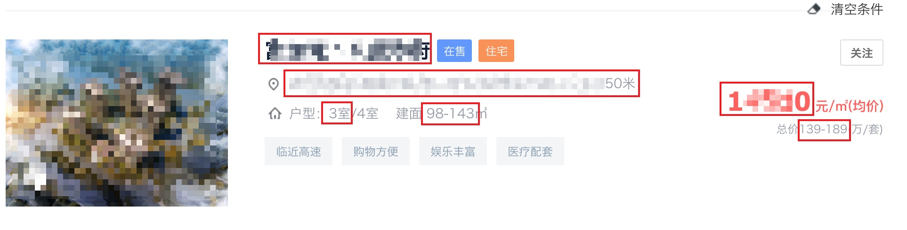
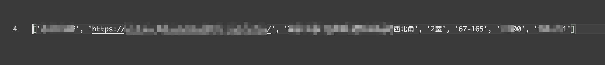

# shell_house

获取某壳新房列表楼盘信息

可获取截图中红框内容信息

获取结果数据如下

### 使用方式

1. 选择相应城市及筛选条件后，打开网页源代码页面，保存 html 文件至本项目 pages 目录，文件名规则「page1.html」「page2.html」（或保存至其他目录，修改代码）
2. 如保存文件数量多于99个，请修改代码 total_page 变量

### 说明

由于两方面原因未提交爬虫方式，如有需要建议自行添加

1. 可能由于反爬虫逻辑，使用 requests 获取数据时，会出现异常数据情况（非页面显示结果的楼盘信息出现、楼盘信息顺序错误）
2. 法律风险
